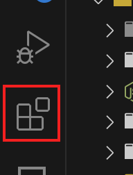
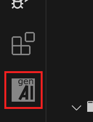

# Getting Started

### GitHub Codespace + GitHub Models

-   Login at [GitHub.com](https://github.com) (+ 2FA)

-   Link GitHub account to Microsoft https://repos.opensource.microsoft.com/link

-   Check access to GitHub Models https://github.com/marketplace/models

-   Create/Open Repository on GitHub https://github.com/new (any owner)

-   **Code** ➡️ **Create codespace on main**

::right::

### GenAID (from the Codespace)

-   Install Extension {.h-15.inline-block.rounded-md.m-1} ➡️ Search **genaid** {.h-10.inline-block.rounded-md.m-1}

-   Press **F1** ➡️ `GenAID: Create new script...`  
    {.h-10.inline-block.rounded-md.m-1} (name it `poem`)
-   Click on the ▶️ icon on the upper right of the editor
-   Open GenAID view {.h-15.inline-block.rounded-md.m-1}
-   Open Terminal (Ctrl+\`) ➡️ `npx genaid run poem`